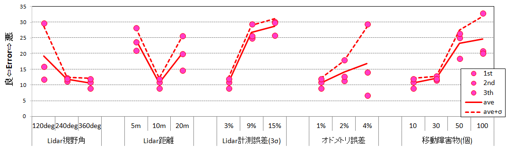
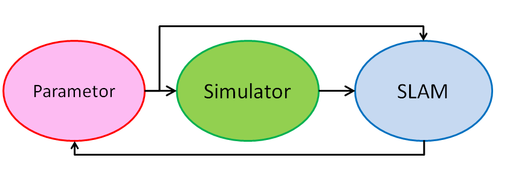

###ROS Japan UG #11 LT大会　17/07/19 
#シミュレーションでSLAMを試す
nnn112358

---

  ROSを始めたきっかけ   
 →オープンソースのSLAMを試したい。  
  gmapping・google cartographer・hectorslam・・・
  

---

やり方を調べて、SLAMはとりあえず動いた。 
→色々、課題が出てくる。  
1. 実機なしで作り込みたい  
シミュレーションが重い/使いづらい→Gazebo  
 

---

####2.実世界の外乱をシミュレーションに入れたい。  
・センサ誤差(Lidar視野角,計測精度)/オドメトリ誤差(タイヤ滑り) 
・人が一杯(邪魔)

---

そこで、、、    

---

##こんな課題を解決するシミュレータを作成した。
（本日の本題）  

---

simulator(仮)

---

アルゴリズム 
Lidarとodometoryに誤差を付与。

---

rqt_graph 
cmd_vei(twist)/move_onst(twist)をInput,Scan(LaserScan)/odom(odom)/tf(odom→base_link)をOutput

---

rqt_graph 
LAMの自己位置と真値を比較できる

---

cartographerでLidar・Odometoryのパラメータを振りながら試してみた 

---

Future works 
・シミュレータのバイナリ化と公開。 
・parameter Self-tuning。 

---

---

