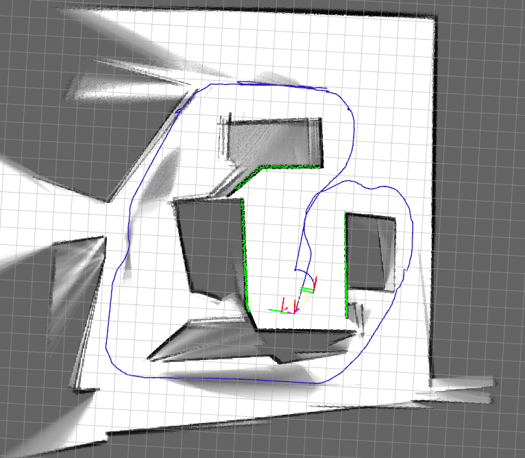
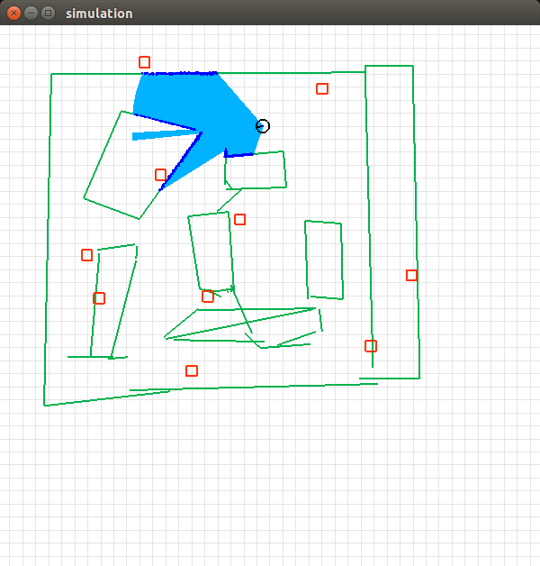

###ROS Japan UG #11 LT大会　17/07/19 
#シミュレーションでSLAMを試す
nnn112358

---

<frameset cols="200,*">

<frame src="example_a.html" name="frame1" title="左フレーム">
<frame src="example_b.html" name="frame2" title="右フレーム">

<noframes>
<body>

フレームの代替内容

</body>
</noframes>

</frameset>

---

ROSを使うきっかけ   
 →スゴイのSLAMを試してみたい。  
  gmapping・cartographer・hectorslam・Autoware・・・  

---

色々調べて、だんだんSLAMを動かせる用になってきた。  

1.シミュレーション環境が重い/使いづらい。
&nbsp;&nbsp;&nbsp;    ⇔ROSではGazebo[汎用的な力学シミュレータ]  
2.SLAMのパラメータ調整が一杯/難しい。  

---

3.シミュレーションで動いても実世界で動かない。   
&nbsp;&nbsp;&nbsp;  　⇔実世界とシミュレーションの違い？   
&nbsp;&nbsp;&nbsp; ・センサの制約(視野角・距離・距離精度)    
&nbsp;&nbsp;&nbsp; ・オドメトリの誤差(滑り、タイヤ径、Encoder分解能)  
&nbsp;&nbsp;&nbsp; ・人が一杯(邪魔)  

---

そこで、、、    

---

##こんな課題を解決するシミュレータを作成した。
（本日の本題）  

---

turtlesim/Gazebo以外の何か(仮)

######・Lidarセンサ想定したKinematic OnlyなSimulation、(たぶん)軽い。  
######・Lidarのパラメータを任意に設定できる。
######・Odometoryの誤差を設定できる。
######・動的障害物を設定可。  

---

---

アルゴリズム  

 ・Lidarを線分で表現。壁・障害物を矩形で設定  
　・線分と線分との交点をもとめる・  
　・交点とロボットとの距離からLidarをシミュレーションする。  
　・Lidar・オドメトリには正規分布に従って誤差をのせる。  

---

試してみた結果  
評価関数  
　ロボット位置の真値とSLAM(cartographer)のx-y 距離  

　線  
　cartographerはLoopCloserが入っているので、  

---

---
