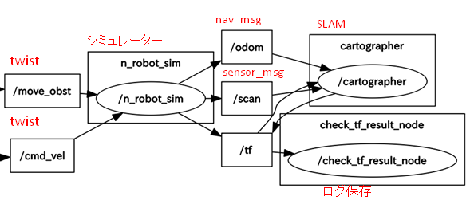

###ROS Japan UG #11 LT大会　17/07/19 
#シミュレーションでSLAMを試す
nnn112358

---

  ROSを使うきっかけ   
 →OpenSourceのSLAMを試してみたい。  
  gmapping・cartographer・hectorslam・・・
  

---

やり方を調べて、SLAMはとりあえず動いた。   
　→色々、課題が出てくる。  

1.シミュレーション環境が重い/使いづらい。  
&nbsp;&nbsp;&nbsp;    →ROSではGazebo   
2.SLAMのパラメータ調整が一杯。  

---

3.シミュレーションで動いても実世界で動かない。   
&nbsp;&nbsp;&nbsp; ・センサの制約(視野角・距離・距離精度)    
&nbsp;&nbsp;&nbsp; ・オドメトリの誤差(滑り、タイヤ径、Encoder分解能)  
&nbsp;&nbsp;&nbsp; ・人が一杯(邪魔)  
&nbsp;&nbsp;&nbsp;  　⇔実世界とシミュレーションの違い

---

そこで、、、    

---

##こんな課題を解決するシミュレータを作成した。
（本日の本題）  

---

turtlesim Next(仮)

---

アルゴリズム  

---
  

----

---

---
