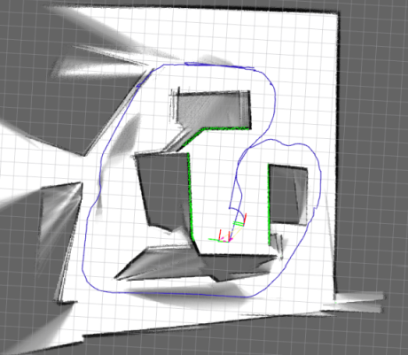

###ROS Japan UG #11 LT大会　17/07/19 
#シミュレーションでSLAMを試す
nnn112358

---

  ROS勉強するモチベーション  
 →オープンソースのSLAMを試したい。  
  gmapping・google cartographer・hectorslam・・・
  

---

やり方を調べて、SLAMはとりあえず動いた。 
→色々、課題が出てくる。  
1. 実機なしで作り込みたい、試したい  
シミュレーションが重い/使いづらい/ 怖い→Gazebo  
 

---

####2.実世界の外乱をシミュレーションに入れたい。  
・センサ誤差(Lidar視野角,計測精度)/オドメトリ誤差(タイヤ滑り) 
・人が一杯(邪魔)

---

そこで、、、    

---

##こんな課題を解決するシミュレータを作成.
（本日の本題）  

---
[simulator(仮)](https://github.com/nnn112358/robotics_Lidar_sim2d)

https://github.com/nnn112358/robotics_Lidar_sim2d		

---

アルゴリズム 
Lidarとodometoryに誤差を付与。

---

rqt_graph 
SLAMの自己位置推定の軌跡と真値の軌跡を比較できる

---

・まとめ 

・Originalのシミュレータを作った 
・センサー誤差・移動物体といった、外乱をいれることができる。 
-Future work 
・シミュレータのpackage化と公開。 

---

----

